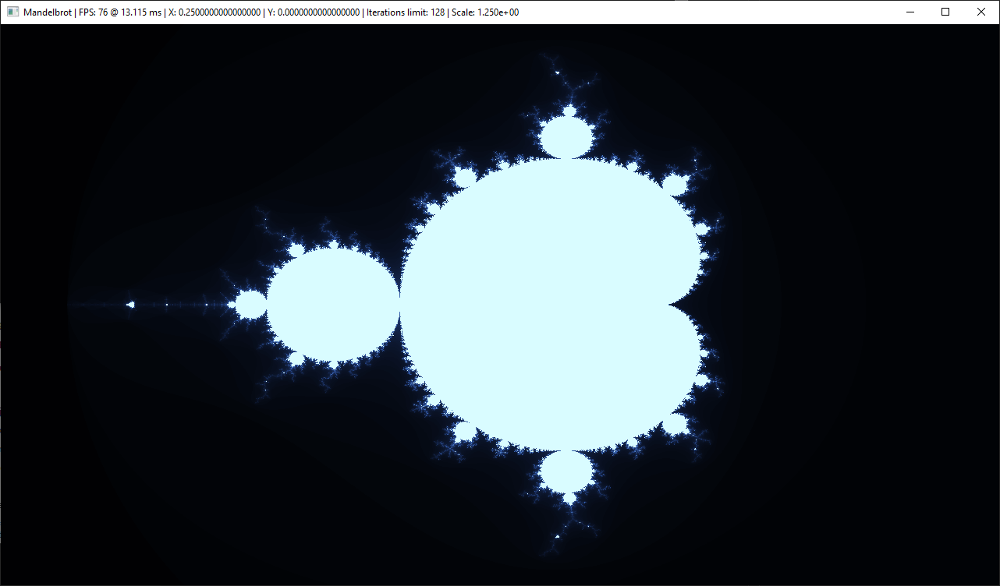

# Mandelbrot



## Controls
- `W` - Move up
- `A` - Move down
- `S` - Move left
- `D` - Move right
- `Up` - Zoom in
- `Down` - Zoom out
- `Left` - Decrease iterations
- `Right` - Increase iterations
- `R` - Reset to default state
- `1` - Point of interest 1
- `2` - Point of interest 2
- `Esc` - Exit

## Build

### Dependencies

Ubuntu
```shell
apt install build-essential cmake libglew-dev libglfw3-dev
```

Archlinux
```shell
# Wayland
yay -S glew glfw-wayland

# X11
yay -S glew glfw-x11
```

### Bootstrap
```shell
mkdir build
cd build
cmake ..
```

### Compile
```shell
cmake --build . -- -j $(($(nproc) * 3 / 4))
```
